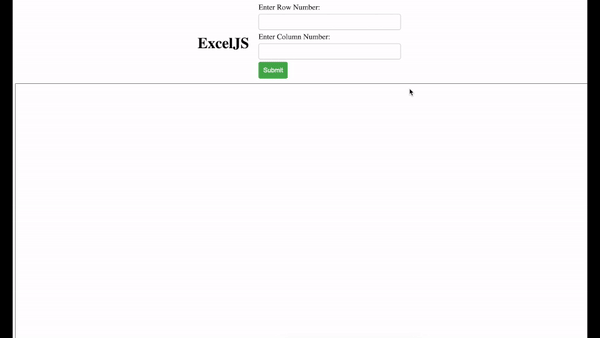

# ExcelJS

This is a simple mini spreadsheet application implemented using JavaScript, HTML and CSS that looks and works like Excel. 

## Features

- **Grid Interface:** Displays data in a grid of cells, with columns labelled A-Z, AA, AB, AC, etc. and rows numbered 1 to 100.
- **Cell Editing:** You can **left-click** on cells to edit their content.
- **Formulas:** Supports basic formulas such as SUM, AVERAGE, and STD. 
- **Formatting:** It has basic formatting options such as bold, italic, and underline for cell content. Right-clicking on a cell opens a menu with formatting options.

## Usage

1. **Opening the Application:**
   - Open the `index.html` file in a web browser to launch the application.

2. **Editing Cells:**
   - Click on a cell to edit its content.
   - To enter a formula, start with an equal sign (`=`) followed by the formula expression (e.g., `=A1+A10`, `=SUM(A1:A10)`, `=AVERAGE(A1:A10)`, `=STD(A1:A10)`).

3. **Formatting Cells:**
   - Right-click on a cell to open the menu.
   - Select formatting options such as bold, italic, or underline.

4. **Saving Data:**
   - The application automatically saves data as you edit it. 

